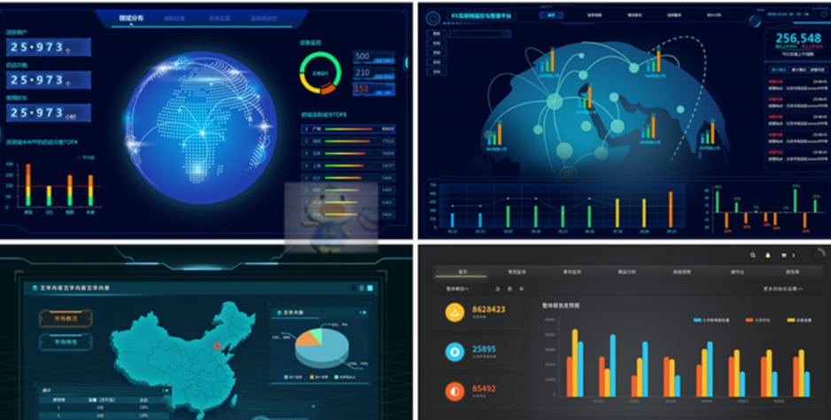
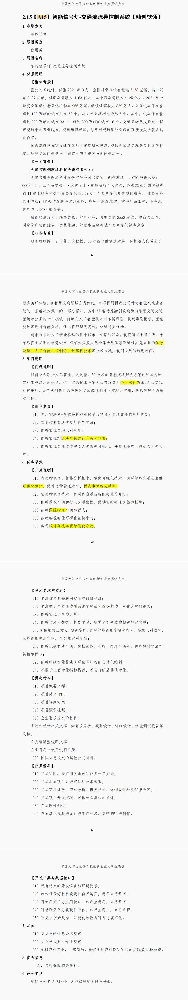
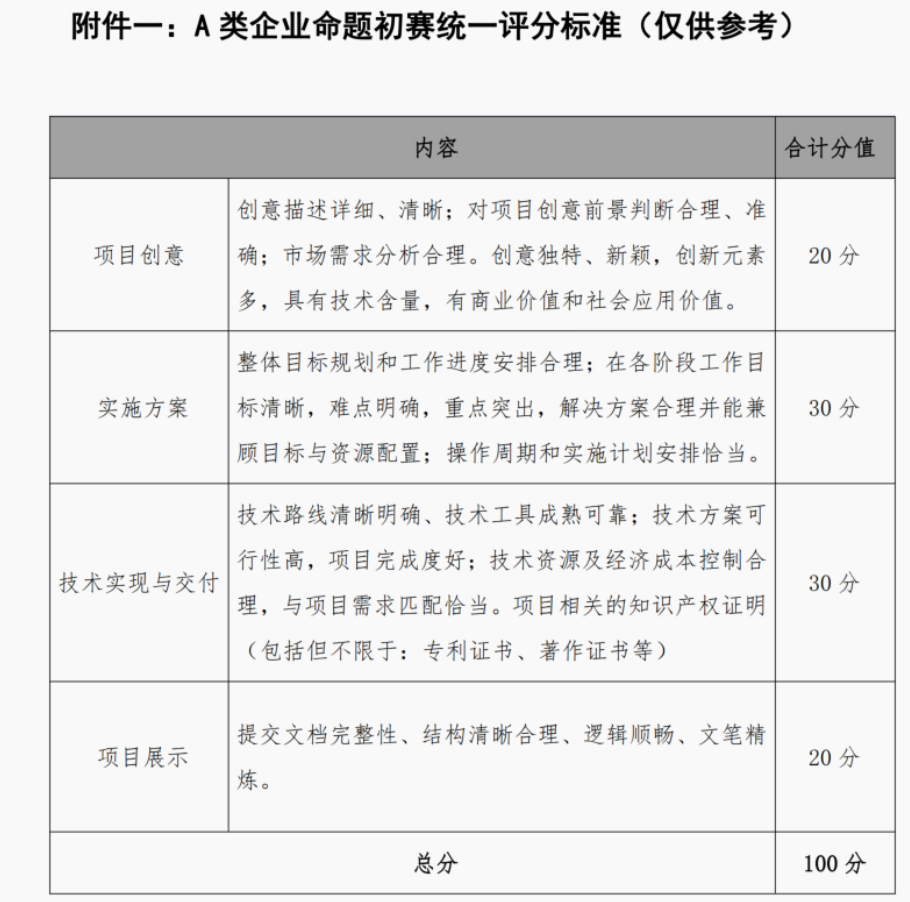
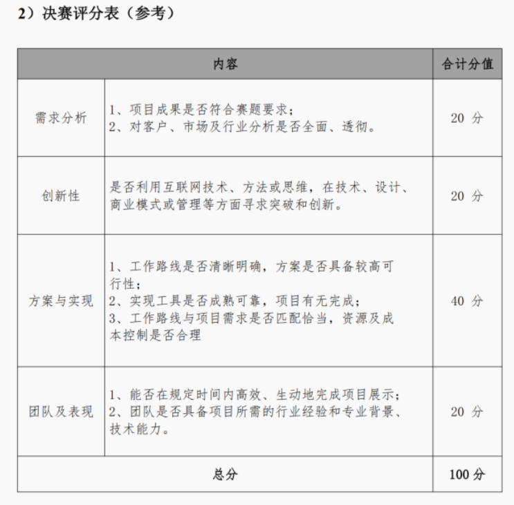
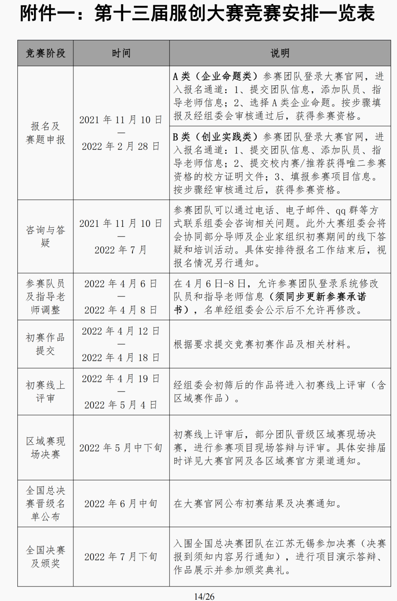

# 智能信号灯-交通流疏导控制系统

## 赛题要求

**【用户期望】** 

（1）使用物联网+视觉分析和机器学习等技术实现智能信号灯控制； 

（2）实现控制交通信号灯疏导算法； 

（3）能够实现自动识别汽车； 

（4）能够实现对违法车辆进行分析和预警； 

（5）能够实现智能监控中心大屏数据可视化，并实现小屏（移动端）控大屏。

**【开发说明】** 

（1）利用物联网、智能分析技术、数据可视化技术，实现智能交通全息的可视化感知，提升运营管理水平、提高事件响应效率； 

（2）使用物联网技术，并制作自适应智能交通信号灯； 

（3）能够获取车辆和行人交通数据，提供实时交通反馈和报警； 

（4）能够跟踪指定车辆和行人； 

（5）能够实现智能可视化监控中心； 

（6）实现根据路况实现智能化导流。

**【技术要求与指标】** 

（1）要求该自制物联网智能交通信号灯；

（2）要求有后台指挥控制系统管理端和数据监控可视化大屏监视端；

（3）能够实现小屏控大屏； 

（4）能够运用大数据、机器学习、视觉分析领域的相关知识实现； 

（5）可使用第三方 AI 相关接口，实现智能识别车辆和行人，要求识别准确， 且能识别中速车辆。至少能识别车辆； 

（6）能够识别非法车辆，包括漏检、套牌、报废车辆等，并能够对非法车辆报警提示； 

（7）能够根据智能算法实现信号灯智能自动化控制； 

（8）不限于上面功能指标描述，可自行扩展其他功能。

具体内容多看群文件PDF

## 界面

>  企业后台系统可视化大数据监控管理PC界面科技感平台PSD设计模板

> 2RMB：https://item.taobao.com/item.htm?id=653924652134

- 小屏幕控制大屏：手机控制电脑。采用 WiFi (Bluetooth)
  - 大屏可以东拼西凑或使用现成产品。例如：Apache Echarts。阿里、百度等公司也提供现成的大屏产品。
  - 使用开源的代码。

- 交互的显示信息:
  - 不同路口的监控视屏
  - 目标检测的可视化点（待定）
  - 不同路口的车流情况
  - 特殊车辆或行人（逃犯，警车）的显示与跟踪
  - 违规预警显示
  - 车牌识别，非法车辆
- 历史记录数据储存。
- 交互的数据类型：

## 嵌入式

- 可控的红绿灯
- 温度湿度检测
- 提醒大屏（路上给提醒（下雨天，减速慢行；前方人少，可加速），用来提高速度）
- 开发板：Jetson NX（有配套的显示屏，已经摄像头）
- 交互的数据类型：

## 机器学习

- 识别非法车辆，包括漏检、套牌、报废车辆等：
  - 车牌检测：Jetson NX的Deepstream
    - 漏检：https://zhidao.baidu.com/question/509667963.html
    
    - 套牌：
    
    - 这里说的非法车辆里面除了漏检之外都很难直接实现。漏检可以通过检测车窗上是否有年检标来实现（注意数据集能不能找到的问题，实在不行就用特征匹配器）。真正实现套牌等情况的检测可能需要接入公安的系统，比如判断车身与驾驶证是否相符。这难以实现，但可以自行实现Demo，只对特定的模型车进行判断。在比赛答辩的时候也比较好解释。
    
      对于难以完成的非法车辆检测，可以偷换一下概念，将“非法”改为“违规”。可直接通过检测车辆的朝向实现。应该也是能拿到赛题一部分分数。
  - 报废车辆：长时间被检测，进行相关的提醒显示
- Reid（行人，车辆跟踪）: PP-tracking 开源
- 识别非法车辆（报警）：
  - 闯红灯
  - 无礼让行人：有相关代码
  - 逆向行驶

- 车牌识别：有相关的开源（将车牌号接入相关的车牌号查询识别系统）
  - 扩展：接入犯罪系统

可能的挑战：

- 夜间检测效果低

可能的改进点：

- 需要考虑Reid联动带来的开销
  - Reid:需要在其他画面进行检测
    - 根据车的走向，预测下一路口中车辆的行驶
    - 将所有的图像拼接起来，进行识别
- 采用新型的resize（论文）
  - 课用于降低输入的图片大小，提高检测的精度或者速度
- 超分辨率：提高图片像素（计算慢）

## 边缘计算的思路

例如，在上述结构中，交通灯等硬件设施由嵌入式控制器（例如，STM***、树莓派等）实现控制，视觉算法搭载于边缘计算终端。来自终端的信息可通过MQTT（或任何其他允许加密的广播系统或协议）将信息发送至服务器或直接显示在大屏。而画面等信息可以通过各种TCP协议（例如：socket）发送至大屏显示。

> 可以理解为，每一个摄像机配一块计算板，在终端实现计算，减轻服务器压力。大屏上只显示信息，不做任何处理。

## 中心计算的思路

---

## 面向用户，落地实际

- 路上给提醒（下雨天，减速慢行），用来提高速度。
- 遇到紧急情况：火警，救护车，警车。
- 指定需要追踪的目标
  - 如果是犯人，可通过控制红绿的方式进行围堵。

- 调控函数：
  - 红绿灯时间调控函数：规定多少辆车，绿灯多久
  - 评价指标函数：少人的路口应该让他们等多久

- 提醒：

  - 以用户的角度进行考虑

  - 多了解一些相关方面的知识，有知识的支撑：
    - 少人的路口应该让他们等多久：《操作系统》
    - 信号处理，控制论…

## 全局

***智能信号灯-交通流疏导控制系统**：*

- 自动：采用一系列的方案进行相关的车流量引导。
  - 信号灯引导：通过改变信号灯时长
    - 连续两个十字路口，使用拓扑优化使所有车辆等待红灯的时间总和最小。
  - 显示屏的引导（费用？）：提醒（地点，事件，可能消耗的时间）
  - 应用的引导（实现可能？）：接入相关的地图APP
- 人为干预（优先级最高）：人为调控改变红绿灯时间。

----

## 作品考虑

- 相关的项目适配：支持各种系统，硬件

## 方法和技术

**机器学习**：学一下Python，然后Tensorflow、PaddlePaddle、Pytorch随便学一个，学一下目标检测算法、Re-ID算法。能够熟练的部署模型。

**展示**：学一下React，移动端学一下React Native，然后找一些开源的大屏把数据接好，配合边缘端做好图像传输，做相关的功能扩展。

**嵌入式**：嵌入式系统和编程基础，会用GPIO控制各种器件，能熟练从传感器读取数值并滤波。这之后学一下esp***，会将硬件接入MQTT。当然，直接用树莓派也是不错的选择。

## 需要的准备

- 航拍摄十字路口视频：
  - 找开源的数据集
- 交通规则，城市规划，智慧城市的相关知识了解：
  - 红绿灯：
    - 南北向，东西向同时绿灯
    - 固定可以右转

  - 红绿灯的布局
  - 其他的影响因素：。。。

## 文档&&答辩

- 经费问题：对比aim.baidu.com
- 效果东西越多，文档写的越多
- 按需求进行作品的完成
- 相关的创新点

## Github 的使用

- 学习资料

- 代码

- 历史回退

- 分支

- 上传时，一定要填写好相关的commit 以及在README.md中填写相关的修改。

  体现项目过程，以后工作，面试人员也会看，GitHub做了多少个项目

## 参考

- 群文件《华为杯文档》
- 有经验的学长

  ## 未来规划

  一周一次腾讯会议，每个人介绍一下一周内的学习情况。

  也可以关注一下相关的比赛，进行报名。

